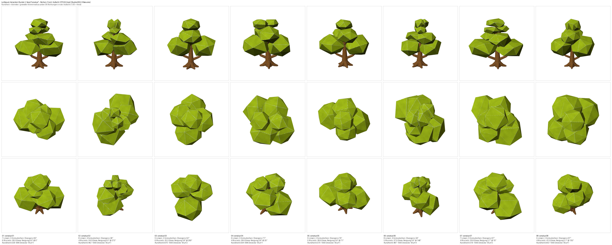

# Leitbaum-Varianten Runde 2 -- rund und vielfaeltiger (Studio#362)

**Anlass:** dipsitter-cnc#71, 2026-08-16: „Gute Richtung, aber ich haette sie
gerne auch **runder** -- nicht nur seitliche Aeste, sondern **um den Radius
des Stammes in alle Richtungen** -- und **vielfaeltiger**."

Drei Reihen: **Front · Aufsicht · RTS 55 Grad**. Die Aufsicht ist neu -- rund
sieht man von oben, nicht von vorn.

Zum Vergleich der Bogen von Runde 1 (zwei Reihen, ohne Aufsicht):
[`../2026-08-16-leitbaum-varianten/bogen-8.png`](../2026-08-16-leitbaum-varianten/bogen-8.png)

## Was sich geaendert hat

Die Linsen der Krone standen bisher in einer Ebene: gemessene Azimute
200 / 20 / 199.9 / 19.9 / 154.8 / 334.8 Grad, also vier Richtungen innerhalb
von ±25 Grad um die Bildachse. Weil jeder Ast seine Richtung aus „seiner"
Linse holt, zeigten auch alle Aeste dorthin.

Jetzt bekommt jede Linsenreihe von unten nach oben eine eigene Richtung
(180 Grad geteilt durch die Zahl der Reihen, beim Nennbaum also 60 Grad), die
beiden Linsen einer Reihe stehen weiter einander gegenueber. Groesse, Hoehe
und Abstand vom Stamm sind unveraendert -- nur die Richtung ist neu.

## Rundheit, gemessen

Kleinster durch groessten Kronenradius ueber 36 Richtungen in der Aufsicht
(1.00 waere ein Kreis), an denselben acht Modellen mit demselben Werkzeug:

| | min | Median | max | Fuellgrad Median |
|---|---|---|---|---|
| Runde 1 | 0.273 | 0.317 | 0.352 | 0.512 |
| Runde 2 | **0.462** | **0.555** | **0.670** | **0.621** |

**Vielfalt:** Bestueckungen mit 5 / 6 / 7 / 8 Linsen kommen 3 / 1 / 2 / 2 mal
vor (Runde 1: 4 / 1 / 3 / 0 -- acht Linsen kamen gar nicht). Dazu neu: die
Reihen-Divergenz streut (44 bis 97 Grad) und der Stamm darf in jede Richtung
neigen, nicht nur in der Bildachse.

## Was die Zahl nicht sagt

Sie misst die Aussenkante der Aufsicht. Nichts ueber Farbe, Textur,
Dichtheit -- und nichts darueber, ob ein runderer Baum ein schoenerer ist.
Das Sichturteil faellt unter Windows; WSL rendert ueber eine andere GL-Kette.

Protokoll und Messwerte:
`conatus-studio/docs/abnahme/2026-08-17-leitbaum-varianten-r2/README.md`
