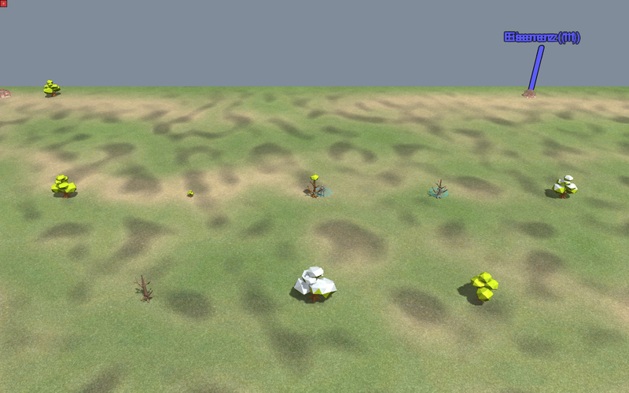
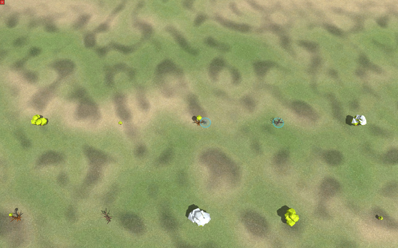
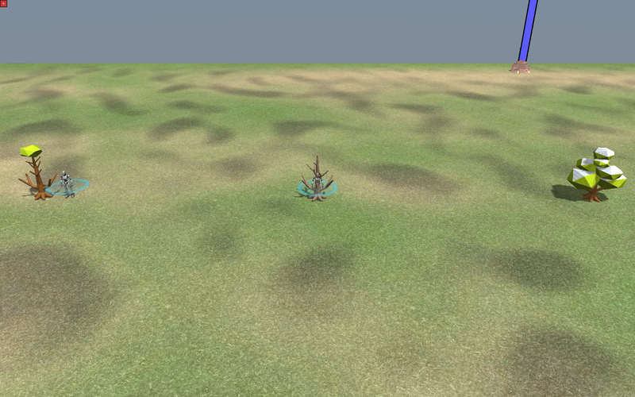

# Baeume im Spiel — Leitbaum + vier Typen (Studio#397 / #362)

Vier Engine-Abzuege der ausgelieferten Baum-Features. Nicht der Kontaktbogen
der Fabrik, sondern die Engine: dieselben Modelle mit derselben Textur, wie
sie im Spiel stehen.

| Bild | Was darauf zu sehen ist |
|---|---|
| `fuenf-typen-rts.png` | eine Reihe mit allen fuenf Typen, RTS-Winkel 62°: Leitbaum · jung · Bueschel · tot · schneebedeckt, dazwischen ein Arbeiter als Massstab |
| `fuenf-typen-rts-zweite-haelfte.png` | dieselbe Reihe weiter oestlich, zweite Fuenfergruppe |
| `aufsicht.png` | Draufsicht auf dasselbe Feld — die Ansicht, in der man Baumtypen im Spiel wirklich unterscheidet |
| `nah-mit-arbeiter.png` | naeher heran, Arbeiter (armpw) neben Leitbaum und jungem Baum |

**Grenze, ehrlich:** die Bilder kommen aus WSL (llvmpipe, Software-GL), nicht
aus der Renderkette der Spiel-PCs. Sie belegen, dass Modell, Atlas und
FeatureDef im Spiel zusammenpassen. Ein Sichturteil zaehlt nur unter Windows.

## ★ NACHTRAG 2026-08-18: dieselben Baeume unter WINDOWS

Erst-Abnahme. Gleiche Karte (`Baumprobe Typen 0.1`, 40 Baum-Features im
Raster), gleiche Modelle -- aber die **Spiel-Engine unter Windows**
(`tools\terrain_sichttest.ps1`, Renderer Intel(R) Arc(TM) Graphics). Damit
zaehlt das Bild als Sichtprobe; die vier WSL-Bilder weiter oben taten das nicht.

Obere Reihe: **alle fuenf Typen nebeneinander**, Reihenfolge
Leitbaum · jung · Ein-Bueschel · tot · schneebedeckt. Der Arbeiter (`armpw`,
26 Elmos) steht als Massstab dazwischen.

Aufsicht auf dieselbe Reihe -- die Ansicht, in der man im Spiel wirklich
unterscheidet:

Nah heran: Ein-Bueschel · tot · schneebedeckt, mit Arbeiter.

**Maschinell schon geprueft** (muss niemand mehr anschauen): 80 FeatureDefs,
40 von 40 Baum→Stumpf-Ketten loesen auf, `category="tree"`,
`reclaimtime=900`, `conatus_resource="wood"`, kein Def-Name ueber 30 Byte.

**Was nur ein Mensch sagen kann:** ob sich die fuenf als fuenf Typen lesen --
und ob der schneebedeckte Baum aus der Aufsicht noch als Baum durchgeht (er
liest sich dort eher als Steinhaufen).

---
