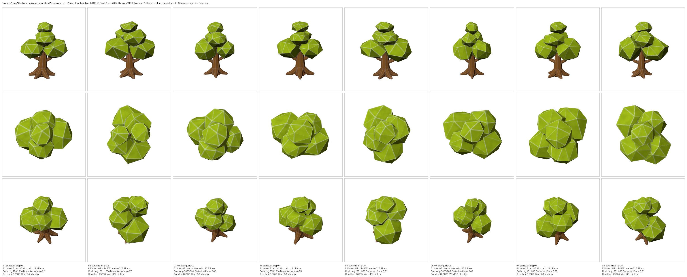
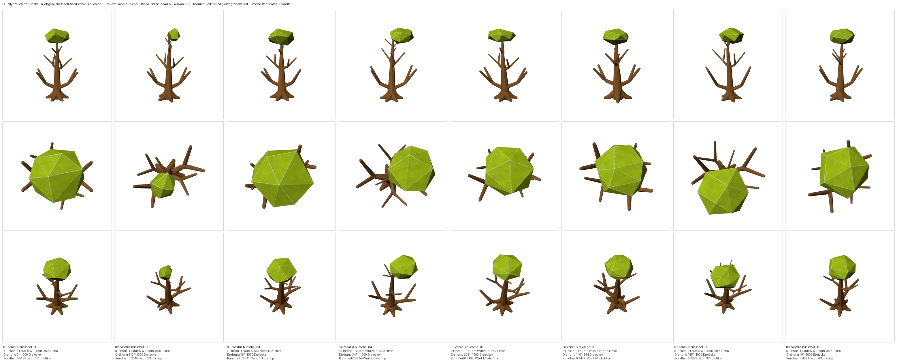
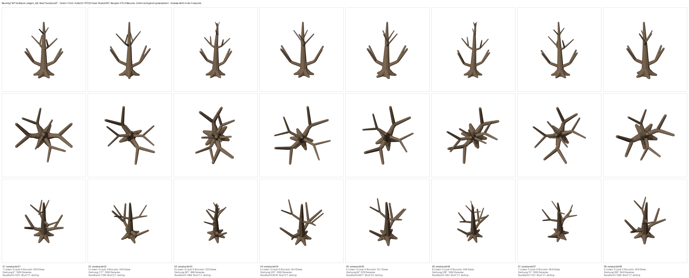
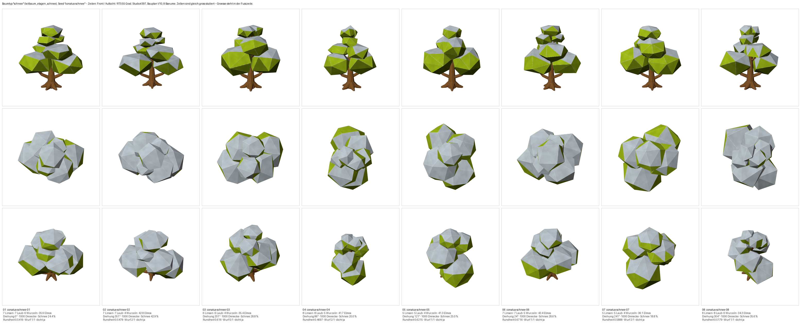

# Baumvielfalt: jung · ein Bueschel · tot · schneebedeckt (Studio#397)

**Anlass:** dipsitter-cnc#71, 2026-08-17 20:57, nach der Abnahme der acht
Leitbaum-Varianten: „Ist gut. Duerfte noch einen Laubbaum mit nur einem
Bueschel Blaetter geben. Und junge Baeume. Und Nadelbaeume. Und tote Baeume.
Und schneebedeckte Baeume. **Wir brauchen massig.**"

Hier sind **vier von fuenf**. Der **Nadelbaum** ist der Erstling einer neuen
Form und braucht deshalb erst deine Geschmacksentscheidung (Zielbild A/B/C) --
er kommt als eigener Zug.

Alle vier entstehen aus **demselben Bauplan** wie der abgenommene Leitbaum. Ein
neuer Typ verschiebt ein paar Nennwerte; die Formregeln, die du am 16./17.08.
freigegeben hast (rund, vielfaeltig), gelten unveraendert weiter.

## Junge Baeume

Klein (11 bis 18 Elmos gebaut -- ein Mech ist 26 hoch, der erwachsene Baum 36),
weniger Astetagen, kleinere Krone auf einem entsprechend laengeren freien
Stamm.

**Ehrlich gemessen:** sie sind dabei **staemmig** geworden, nicht schlank. Die
Krone ist kleiner, der Stamm aber gleich dick geblieben -- gemessen ist er
relativ ein Drittel dicker als beim erwachsenen Baum. Botanisch ist ein
Schoessling das Gegenteil (duenner Stamm). Das ist absichtlich **nicht**
nachgebessert: es waere eine Formaenderung, und ich weiss nicht, ob dich das
stoert. Sag es, wenn ja -- dann bekommt der Stamm einen eigenen Regler.

## Ein Bueschel Blaetter

Derselbe Baum wie der Leitbaum, aber nur **eine** Etage traegt Laub -- die
oberste. Die anderen Aeste bleiben nackt.

## Tote Baeume

Kein Laub, dazu vergraute Rinde: gleicher Farbton wie lebendes Holz, aber die
halbe Saettigung.

## Schneebedeckte Baeume

Der Schnee ist **Farbe, nicht Geometrie**: was steiler nach oben schaut als
eine Schwelle, bekommt die Schneezone. Kostet kein einziges Dreieck, und die
Schwelle streut je Baum -- gemessen 19 bis 43 % der Laubflaechen unter Schnee.
Von oben (mittlere Reihe) ist das die Ansicht, die im Spiel zaehlt.

## Drei Zeilen je Bogen

**Front · Aufsicht · RTS 55 Grad**, acht Baeume je Typ. Die Zellen sind gleich
gross skaliert -- **Groessenunterschiede siehst du auf dem Bogen nicht**, die
Elmos stehen in der Fusszeile jeder Spalte.

## Was gemessen ist

| Typ | Dreiecke | gebaute Hoehe | „ist noch derselbe Typ" (Schwelle 0.83) |
|---|---|---|---|
| jung | 816 .. 1000 | 11.3 .. 18.1 | 0.870 .. 0.927 |
| ein Bueschel | 894 .. 1000 | 32.3 .. 40.2 | 0.840 .. 1.000 |
| tot | 904 .. 1000 | 25.8 .. 36.6 | 0.878 .. 1.000 |
| schneebedeckt | 1000 | 34.3 .. 43.4 | 0.883 .. 1.000 |

Alle 32 Baeume sind wasserdicht (0 Loecher, 0 kaputte Kanten), alle halten das
Polygonbudget, und **je Typ sind alle acht wirklich verschieden** -- nachgewiesen
ueber einen Fingerabdruck des Meshes, nicht behauptet.

## Ein Fund am Rande, der eine alte Zusage relativiert

Der junge Baum kam zuerst mit Loechern heraus. Die naheliegende Erklaerung --
„die kleinere Krone ist schuld" -- ist **falsch**: derselbe **unveraenderte**
erwachsene Baum kommt bei 36, 32, 28, 24 und 14 Elmos sauber heraus, bei
**19 Elmos aber mit 7 Loechern und 15 kaputten Kanten**. Bei 36 gebaut und
danach verkleinert: wieder sauber.

Es ist also kein Formfehler, sondern der Boolean-Rechner von Blender, der an
manchen Zahlenkonstellationen stolpert. Die Zusage „0 kaputte Kanten" aus dem
Leitbaum-Zug war an acht Baeumen gemessen und stimmte -- sie war aber **Glueck
dieser acht Lagen**, keine Eigenschaft des Bauplans.

Eingebaut ist deshalb ein **Wurf**: ist ein gebauter Baum nicht dicht, wird die
Variante neu gewuerfelt und neu gebaut (hoechstens sechsmal). Im ganzen Lauf
brauchte das **2 von 32** Baeumen. Nicht gemacht: die Nennhoehe so lange
verschieben, bis der Rechner still ist.

## Was du entscheiden musst

**Nur eines: lesen sich die vier als vier Typen?** Schau bitte die mittlere
Reihe (Aufsicht) an -- die zaehlt im Spiel. Und bitte **unter Windows**: WSL
rendert ueber eine andere Grafikkette und zeigt messbar andere Farben.

Danach geht der Nadelbaum als A/B/C-Bogen an dich.

Ausfuehrliches Protokoll mit allen Zahlen:
`docs/abnahme/2026-08-18-baumvielfalt/README.md` im Studio-Repo,
Bauplan-Abschnitt **V10** in `docs/assets/bauplaene/leitbaum-etagen.md`.
