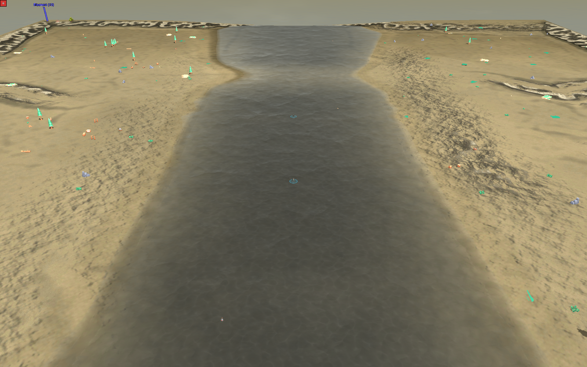
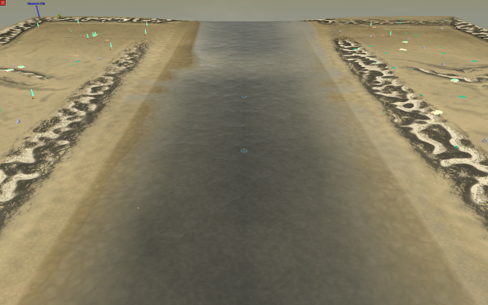
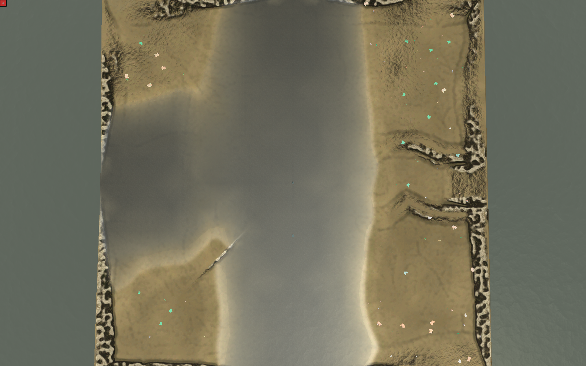
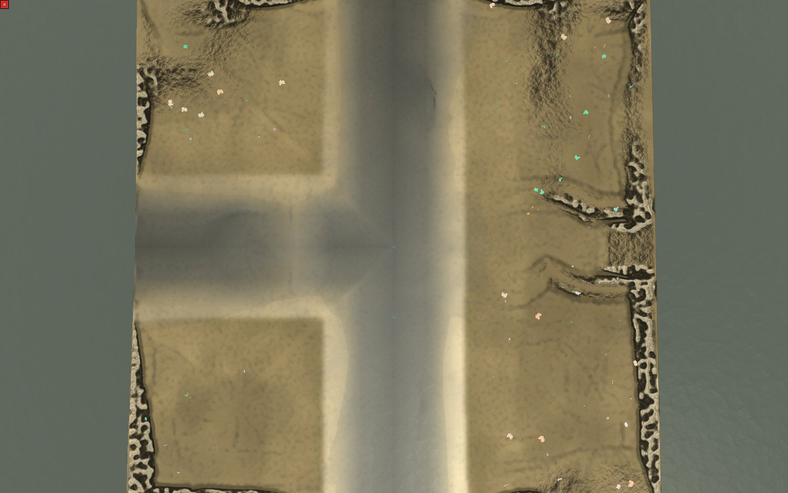

# Fluesse ohne Verengung, trockenerer Standard (Studio#408, cnc#90)

**2026-08-18.** Alle acht Bilder sind **Windows**-Abzuege der Spiel-Engine
(`tools/terrain_sichttest.ps1`, Renderer der Windows-Installation), gleiche
Kamera, gleiche Karte, nur einmal mit dem alten und einmal mit dem neuen
Kontinentfeld. Keine WSL-Bilder, keine Datenbilder.

## Was der Mensch gesagt hat

Zu den Bildern aus [#396](https://github.com/DipsitterUG/Conatus-Studio/issues/396)
(dipsitter-cnc#90, 2026-08-18), mit zwei markierten Ausschnitten -- einer zeigt
den Fluss, der genau an der Kartenkante zusammenschnuert, der andere eine
Sanduhr-Taille mitten im Lauf:

> zu 1: Diese Verengungen stoeren (nicht nur bei 1, generell sollen die Fluesse
> ueber die Map „auslaufen" ohne Verengung) … Ansonsten schon gut!
>
> zu 2: das kann mal sein. 1% der Karten, sonst ist es fuer standard zu nass.

## Zelle 2-7 -- der Fluss laeuft von Nord nach Sued durch die ganze Karte

**vorher** (Kartensatz 0.2): schmal an der fernen Kante, dann trichterfoermig
breiter. Genau der erste markierte Ausschnitt.

**nachher** (Kartensatz 0.3): zwei parallele Ufer von Kante zu Kante. Was noch
schmaler wirkt, ist die Perspektive der Kamera, nicht das Wasser.

Aufsicht dazu: [vorher](windows/zelle-2-7-aufsicht-vorher.png) ·
[nachher](windows/zelle-2-7-aufsicht-nachher.png)

## Zelle 2-6 -- die Nachbarzelle

**vorher**: mehr als die Haelfte der Karte ist eine graue Wasserflaeche.

**nachher**: zwei Laeufe kreuzen sich, dazwischen steht Land.

RTS-Winkel dazu: [vorher](windows/zelle-2-6-rts-vorher.png) ·
[nachher](windows/zelle-2-6-rts-nachher.png)

## Gemessen, nicht geschaetzt

Am **Hoehenfeld der gebauten Pakete** (513x513 Stuetzstellen, Band −25..220
Elmo), nasse Breite je Kartenzeile:

| | `map_2_6` | `map_2_7` |
|---|---|---|
| nasse Breite je Zeile, vorher | 73–370 px, min/median **0,32** | 53–161 px, min/median **0,47** |
| nasse Breite je Zeile, nachher | 121–319 px, min/median **0,98** | 121–130 px, min/median **0,98** |
| Wasseranteil der Karte | 52,1 % → **33,1 %** | 23,0 % → **24,0 %** |
| Neigungsgrenze (10 Grad) | erfuellt, umgebaut 4,67 % → **3,98 %** | erfuellt, 1,57 % → **1,24 %** |

Am **Kontinentfeld**, Standard-Planet 20260815, 10x10:

| Kennzahl | vorher | nachher |
|---|---|---|
| nasse Breite quer zum Lauf | 0,083 bis 1,000 Zellen | **0,240 Zellen, ueberall** |
| schlechtestes min/median ueber alle sechs Laeufe | **0,055** | **1,000** |
| Zellen mit ueber 50 % Wasser | **10 von 100** | **1 von 100** |
| Zellen mit ueberhaupt Wasser | 34 | 29 |
| Fluesse / verworfen | 6 / 0 | 6 / 0 |

## Warum die Breite vorher schwankte

Sie war **nirgends gesetzt**. Sie fiel als Hoehenlinie des Talprofils auf
Spiegelhoehe heraus:

    nasse Halbbreite = Talhalbbreite * smoothstep^-1( (Spiegel - Sohle)
                                                    / (Gelaende - Sohle) )

und alle drei Groessen darin wandern entlang des Laufs: die Sohle (0,030
Feldhoehe unter dem Spiegel im Regelfall, **0,008 an der Furt** -- die
Sanduhr-Taille), das Gelaende daneben (0,19 bis 0,33 Feldhoehe je Kante -- der
Faktor zwei zwischen zwei Kartenzeilen) und die Talbreite selbst (Sprung
0,38 → 0,22 an der Naht `map_2_6|map_2_7` -- die Schnuerung auf der Kante).

Seit #408 ist die Wasserflaeche der Regler: das Bett steigt in
`WASSER_HALBBREITE_ZELLEN = 0,12` **genau auf die Wasserlinie** und erst danach
aufs Gelaende. Die Uferlinie liegt damit per Konstruktion ueberall gleich weit
von der Laufmitte -- unabhaengig von Sohlentiefe und Nachbargelaende.

## Wie die Bilder entstanden sind

1. `build-cell-mapset --zellen "2,6;2,7"` aus dem Studio-Branch
   `agent/issue-408` (nachher) bzw. aus `main` (vorher) in ein
   **Wegwerf-Verzeichnis** -- die Pakete liegen **nicht** auf dem Map-Server.
2. `.sdd` → `.sd7` (7z), nach `C:\Users\chede\Conatus-Austausch\issue-408\`.
3. `powershell -File tools\terrain_sichttest.ps1 -MapFile <sd7> -Map "<Springname>"
   -Kameras "2048,2048,4700,3|2048,2600,1400,60"` — Aufsicht und RTS-Winkel.

## Was diese Bilder NICHT zeigen

- **Keine Partie.** Ob sich ein 1-km-Fluss als Hindernis richtig *anfuehlt*,
  sagt nur ein Spiel.
- **Nur zwei von hundert Zellen.** Die Breitenzusage ist ueber vier Planeten
  und alle ihre Laeufe gemessen (`tests/test_flussbreite.py`), aber gesehen
  hat sie hier nur dieses Paar.
- **Der Terrain-Look ist nicht Gegenstand** dieses Vorgangs (Studio#16). Das
  wurmartige Hell-Dunkel im Randsaum ist Textur, nicht Geometrie -- am
  Hoehenfeld nachgemessen (#396).

## Verweise

- Vorgang: <https://github.com/DipsitterUG/Conatus-Studio/issues/408>
- Vorlaeufer: [#396](https://github.com/DipsitterUG/Conatus-Studio/issues/396)
  (Hoehenmischung, Flussbett im Feld),
  [#386](https://github.com/DipsitterUG/Conatus-Studio/issues/386) (Kantenprofil)
- Bilder von dort:
  [2026-08-18-kontinentfeld-gewaesser](../2026-08-18-kontinentfeld-gewaesser/)
- Doku: `docs/worldgen/kontinentfeld.md`, Abschnitt „Wasserbreite und
  trockenerer Standard"

Herkunft: Eigenarbeit. Kein fremdes Bildmaterial, keine fremden Daten; alle
Bilder aus der eigenen Engine auf eigenen Karten.
