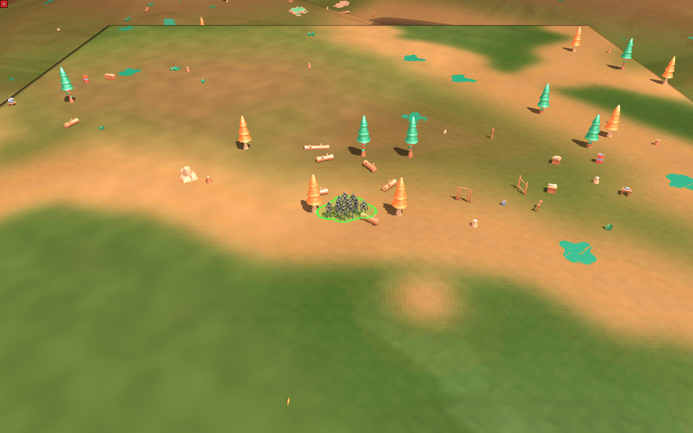
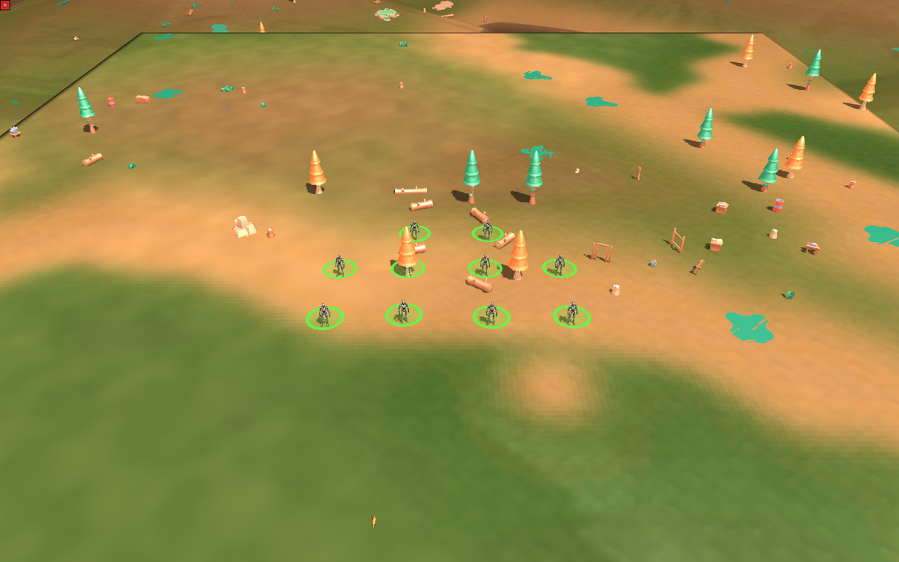
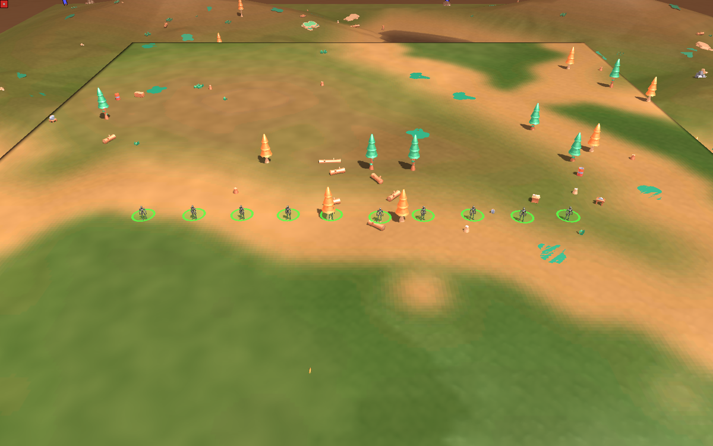
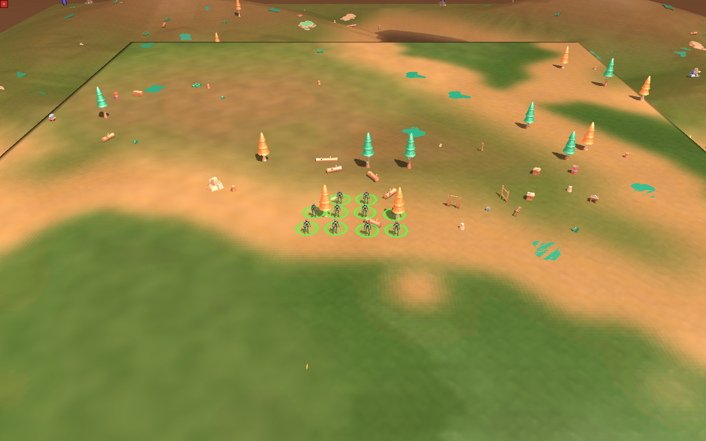

# Bewegungsbefehl haelt Abstand — Regimenter statt Haufen

Studio#406, Ansage des Menschen aus cnc#77 (2026-08-18): „10 Einheiten stehen
nach Bewegungsbefehl **nicht zu nah beieinander** (Regimenter, kein Verbund),
gern mit Auswahl im HUD."

Alle vier Bilder: Windows-Engine (`tools/terrain_sichttest.ps1`), Karte
*Conatus Feature Showcase 0.1*, dieselbe Kamera, zehn Grunts (`armpw`,
Fussabdruck 32 Elmo), derselbe Bewegungsbefehl ueber 400 Elmo, Bild bei
Frame 330 (Ankunft war Frame ~240).

## Vorher — der Befund

Zehn Einheiten, eine Auswahlflaeche. Gemessener mittlerer Abstand zum
naechsten Nachbarn: **8,4 Elmo = 0,26 Fussabdruecke**. Sie stehen ineinander.

## Nachher — Vorgabe „locker"

**53,8 Elmo = 1,68 Fussabdruecke.** Vier / vier / zwei, ausgerichtet an der
Marschrichtung.

## Auswahl im HUD

Drei Knoepfe ueber dem Dock, sichtbar sobald eigene bewegliche Einheiten
ausgewaehlt sind: **Linie · Locker · Eng**.

| | Linie | Eng |
|---|---|---|
| |  |  |
| Nachbarabstand | 53,0 Elmo (1,66 Fussabdruecke) | 29,8 Elmo (0,93) |
| Ausdehnung | 245,7 Elmo | 56,0 Elmo |

## Messung, nicht Eindruck

Der Waechter `tools/conatus_formation_smoke.sh` faehrt vier headless-Laeufe
(Regel aus / locker / eng / linie) und urteilt ueber den mittleren
Nachbarabstand. Die Rot-Probe steckt in ihm: der Lauf **ohne** Regel muss unter
der Zusage bleiben — sonst misst der Waechter nichts.

Was er **nicht** sagt: ob es sich am Spieltisch richtig anfuehlt, wie sich
gemischte Gruppen, enge Taeler oder ein Marsch unter Beschuss verhalten. Das
sieht nur der Mensch.
