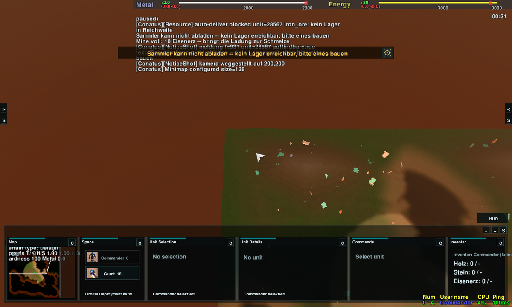
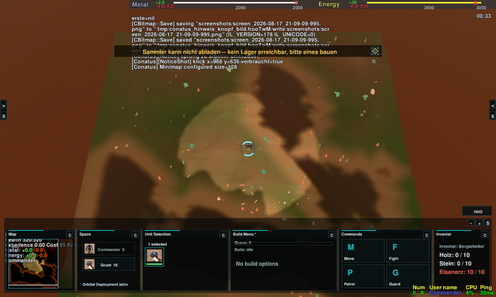
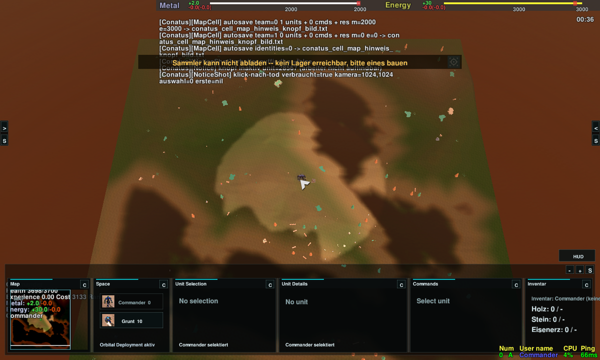
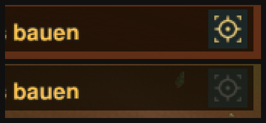

# Lieferungs-Meldung: Knopf springt zum Arbeiter (Studio#398)

**Anlass:** dipsitter-cnc#30, 2026-08-17 21:28, bei der Abnahme des
Auto-Ablieferns: „ist gut … noch einen **Knopf in die Nachricht** einbauen, der
bei Klick auf den jeweiligen Arbeiter zeigt. Dieses Symbol [Bild] einmal von
ChatGPT nachbauen lassen."

**Das Symbol hier ist ein Platzhalter.** Dein Anhang aus cnc#30 ist aus der
Arbeitsumgebung (WSL) nicht abrufbar; im Austauschordner lag am 18.08. nur eine
md-Datei. Bis die Vorlage vorliegt, traegt der Knopf ein selbst gezeichnetes
Ortungszeichen (Fadenkreuz im Peilrahmen, aus Code erzeugt, kein
Fremdmaterial). Der Austausch ist eine Dateikopie -- am Spiel aendert sich
dafuer nichts.

Alle drei Bilder kommen aus **einem** Lauf im laufenden Spiel. Die Meldung ist
echt: sie kommt aus dem Wirtschafts-Gadget (Sammler voll, kein Lager auf der
Karte), nicht aus dem Testwerkzeug.

## 1. Die Meldung mit dem Knopf -- Kamera bewusst weit weg

Kamera in der Kartenecke (200,200), nichts ausgewaehlt (siehe „No selection"
unten). Der gemeldete Sammler steht in der Kartenmitte und ist nicht im Bild.

## 2. Nach dem Klick auf den Knopf

Kamera auf dem Sammler (1024,1024), **genau er ist ausgewaehlt** -- unten
„1 selected", und das Inventar-Feld zeigt „Bergarbeiter … Eisenerz: 10 / 10",
also den Sammler, der die Meldung ausgeloest hat.

## 3. Arbeiter weg -- Knopf grau und still

Derselbe Knopf, nachdem der Sammler zerstoert wurde: er ist gedaempft, ein
Klick loest keinen Sprung aus und keine Fehlermeldung. Das ist die Zusage aus
dem Vorgang („verschwindet der Arbeiter, ist der Knopf inaktiv").

## Aktiv gegen inaktiv, dreifach vergroessert

Oben aktiv (warmes Gold wie der Meldungstext), unten inaktiv (grau,
halbdurchsichtig).

## Was diese Bilder nicht koennen

Sie sind unter WSL mit Software-Rendering (llvmpipe) entstanden, nicht auf der
Grafikkarte der Spiel-PCs. Sie belegen **Vorhandensein und Wirkung** des
Knopfs, nicht Optik und Lesbarkeit auf deinem Bildschirm -- das Sichturteil
bleibt bei dir unter Windows.

Der Text hinter der Meldung ist Konsolenlaerm der Probe (sie schreibt ihre
Messwerte mit), kein Spielzustand.

Werkzeug: `tools/conatus_hinweis_knopf_bild.sh` im Spiel-Repo.
