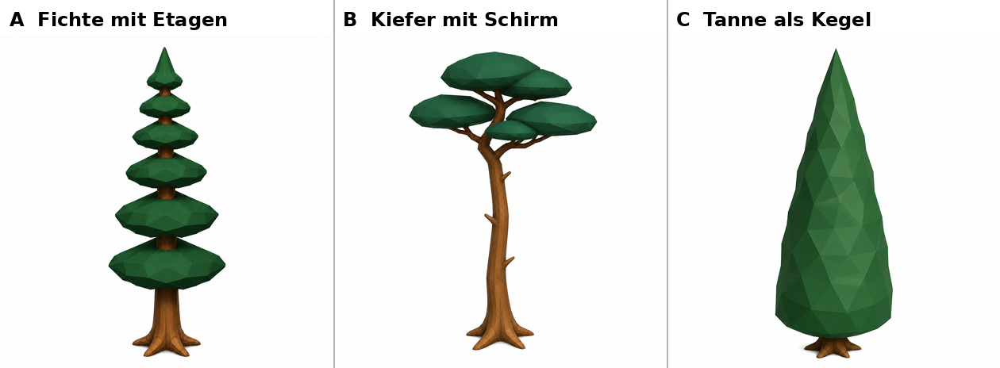
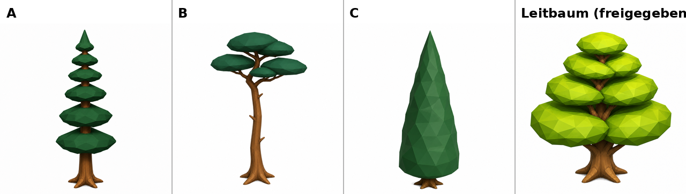
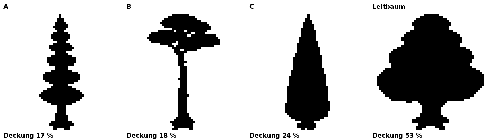
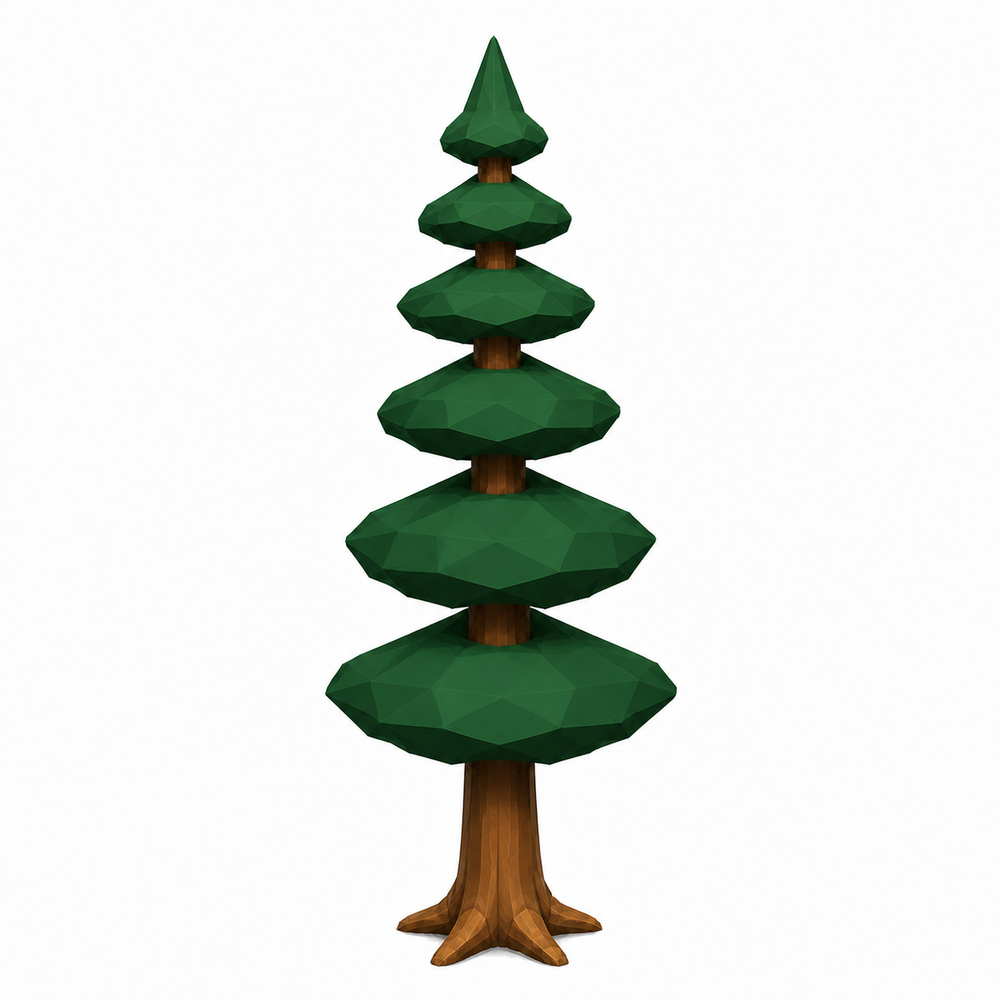
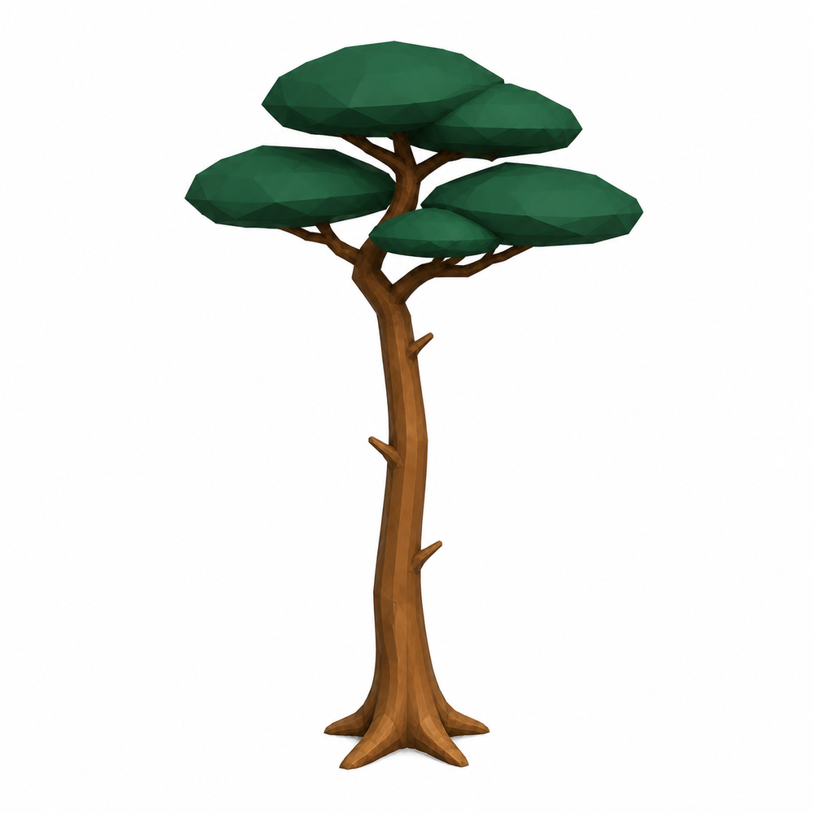
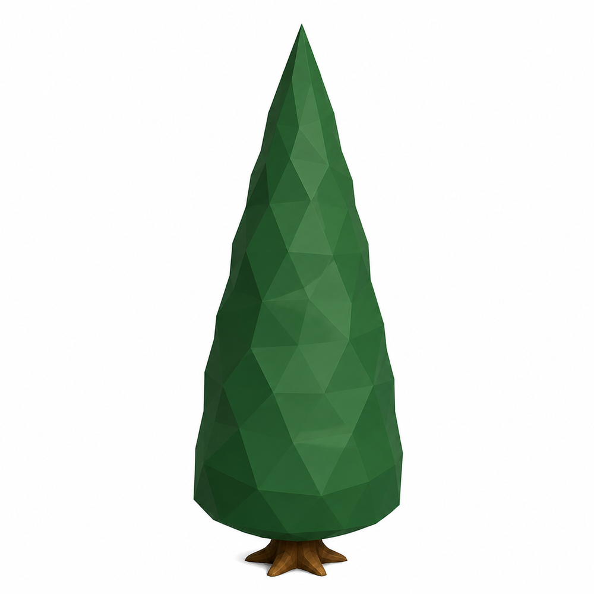

# Nadelbaum — drei Zielbild-Kandidaten (Studio#397, Stufe 2, Schritt 0)

Erstling eines neuen Baumtyps. Der Mensch waehlt einen Buchstaben; erst danach
entsteht ein Bauplan (Bauplan-Verfahren, Regel 1).

**Eine Achse:** wie viel Stamm ist frei — und wie ist die Nadelmasse an ihm
verteilt?

| | A Fichte mit Etagen | B Kiefer mit Schirm | C Tanne als Kegel |
|---|---|---|---|
| Aufbau | sechs Etagen mit Luecken, Stamm laeuft durch | zwei Drittel kahler Stamm, Schirm oben | ein geschlossener Kegel bis fast zum Boden |
| Silhouette Breite/Hoehe | 0.378 | 0.629 | 0.378 |
| Deckung auf 56 px | 17 % | 18 % | 24 % |
| Holzanteil im Bild | 0.200 | 0.375 | 0.033 |

Zum Vergleich der Leitbaum (freigegeben 2026-08-15): B/H **0.925**, Deckung
**53 %**, Holzanteil 0.142.

## Neben dem Leitbaum — gleiche Welt, gleicher Massstab

## Der Umriss auf 50 Metern

Die Deckung trennt jeden Kandidaten klar vom Leitbaum, **A aber nicht von B**
(17 % gegen 18 %) — dafuer traegt die Form: Zacken (A), Stiel unter dem Schirm
(B), glatte Kante (C).

## Einzelbilder

| A | B | C |
|---|---|---|
|  |  |  |

## Vorschlag: A

A ist auf 56 px sofort kein Leitbaum und traegt trotzdem dieselbe
Formensprache (Etagen mit Luecken, Stamm sichtbar, breiter Wurzelfuss).
C ist die sichere zweite Wahl fuer Waldfueller — billigster und robustester
Koerper. B ist der reizvollste Einzelbaum, aber der schwaechste *Nadel*baum.

Zahlen und Protokoll: `messwerte.json`; vollstaendiger Bericht im Studio-Repo
unter `docs/abnahme/2026-08-18-nadelbaum-bauplan/README.md`.

Herkunft: eigene Bildwerkstatt (gpt-image-2 ueber die ChatGPT-Anmeldung),
Messung mit numpy/PIL. Kein Fremdmaterial.
