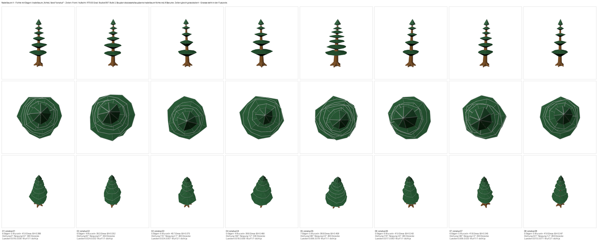
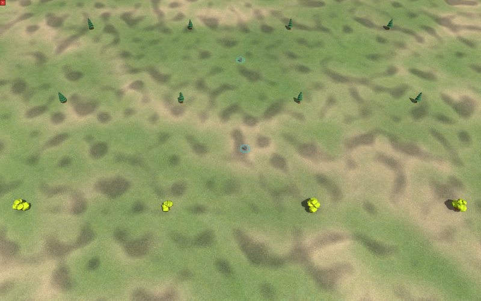
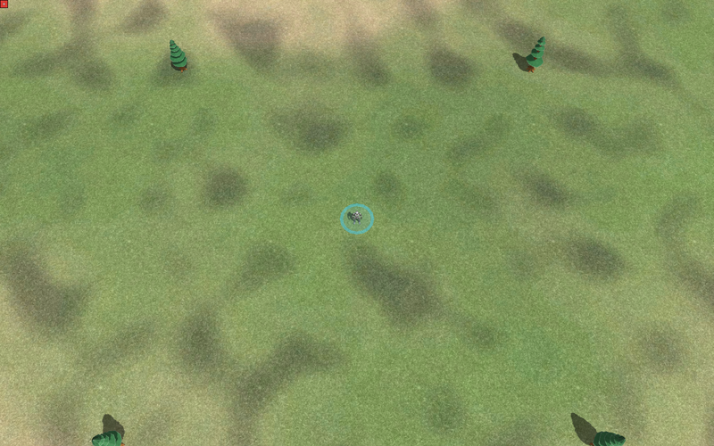
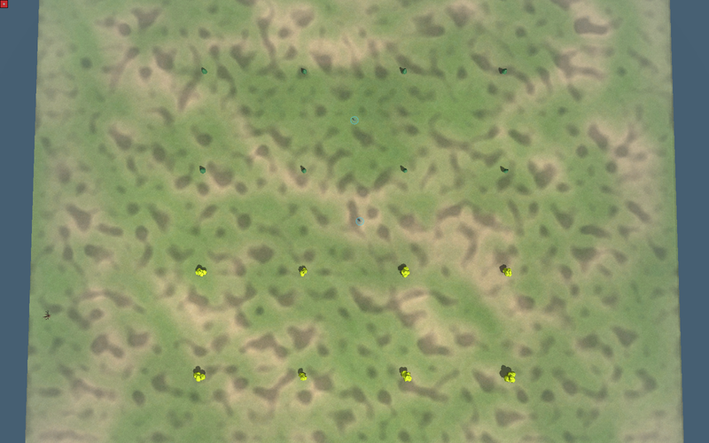
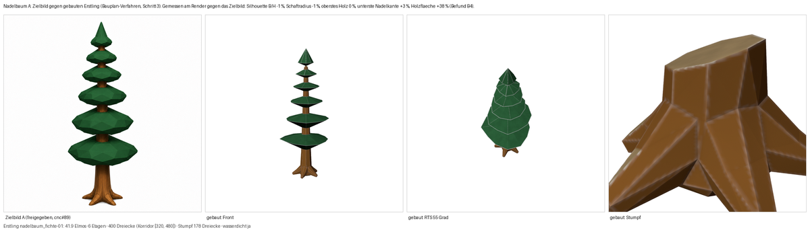

# Fichte steht im Spiel — acht Varianten neben dem Leitbaum

Studio#397 Stufe 2. Zielbild **A** hattest du in cnc#89 gewaehlt („A geht jetzt
in den Bau"). Das hier ist das Ergebnis, kein neuer Vorschlag.

## Die acht Varianten

Zeilen: Front · Aufsicht · RTS 55°. Alle acht dicht (0 offene Raender, 0
nicht-mannigfaltige Kanten), 336–400 Dreiecke gegen den Korridor 320–480,
acht verschiedene Modell-Pruefsummen — kein Zwilling im Bogen.

## Massstab: Fichte neben Leitbaum

Windows-Engine (`tools/terrain_sichttest.ps1`), Wegwerf-Karte *Fichtenprobe
0.1*, zwei Reihen Fichten (oben, dunkelgruene Kegel) ueber einer Reihe
Leitbaeume (unten, gelbgruene Wolken). Dazwischen zwei `armpw`-Grunts als
Massstab.

| | gebaute Hoehe | Fussabdruck `armpw` = 32 Elmo |
|---|---|---|
| **Fichte** (neu) | 38,3 .. 41,9 Elmo | 1,20 .. 1,31 × |
| Leitbaum (#362) | 32 .. 42 Elmo | 1,00 .. 1,31 × |

Gleiche Grössenklasse, anderer Umriss — das war die Absicht.

## Render gegen dein Zielbild

Sechs Masse nachgemessen, fuenf innerhalb 3 %: Silhouette B/H −1 %,
Schaftradius −1 %, oberstes Holz 0 %, unterste Nadelkante +3 %, Nadelmasse
+2 %. Der Ausreisser ist die **Holzflaeche** (+38 %) — der Stamm blitzt
zwischen den Etagen mehr durch als am Zielbild. In der RTS-Ansicht ist er
fast vollstaendig verdeckt.

## Was maschinell schon steht

16 FeatureDefs (8 lebende Fichten + 8 Stuempfe), Namen im Byte-Limit,
`conatus_resource = "wood"`, jede Zerfallskette aufloesbar; Holzernte-Waechter
PASS (117 statt 101 Ressourcen-Features, Bilanz 98300/98300); tex1-Alpha 0,
tex2-Alpha 255 an allen 16 Modellen. Alles aus eigener Fabrik, je Datei ein
Herkunftsnachweis.

## Offen — nur wenn du willst

Der Nadelschurz ist hier ein gerader Kegel, am Zielbild leicht gewoelbt.
Gewoelbt kostet rund 60 Dreiecke je Baum. Keine Rueckmeldung = bleibt gerade.
