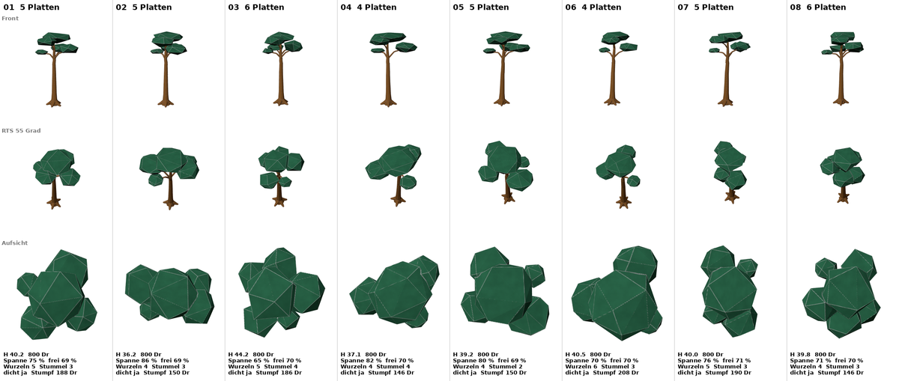
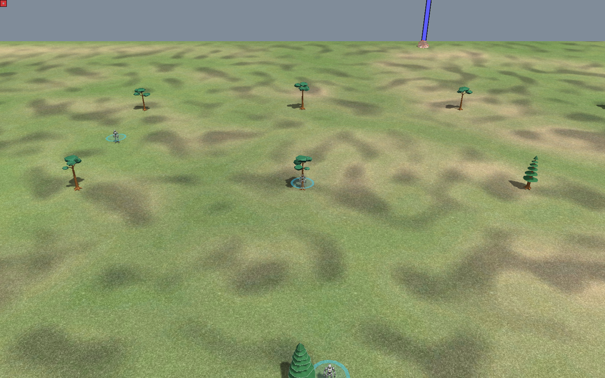
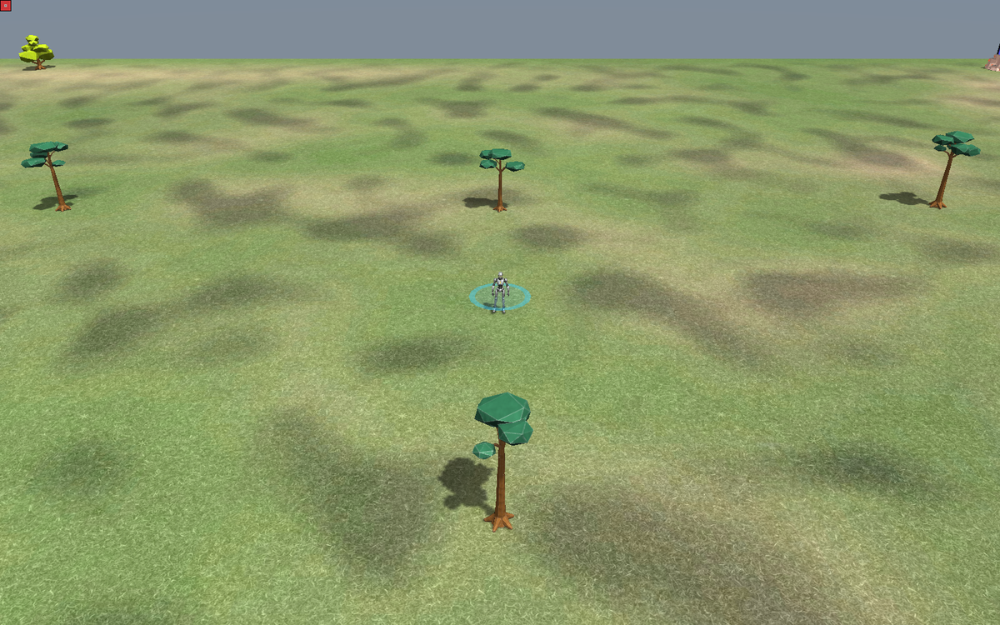
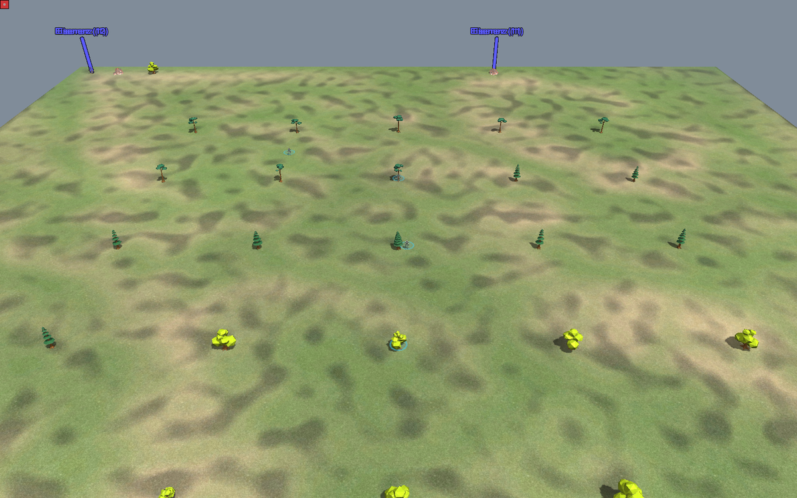
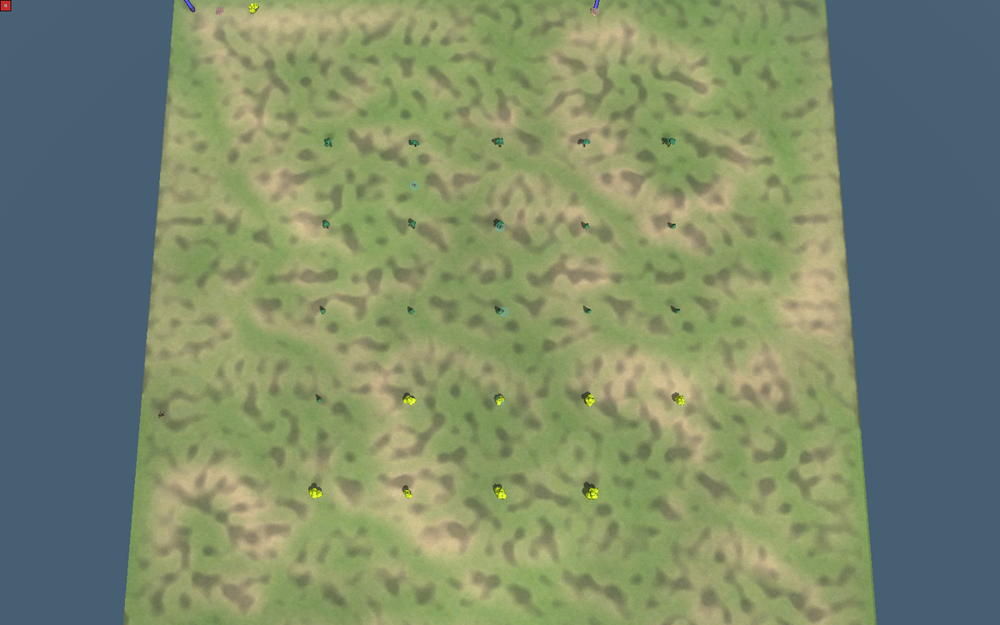
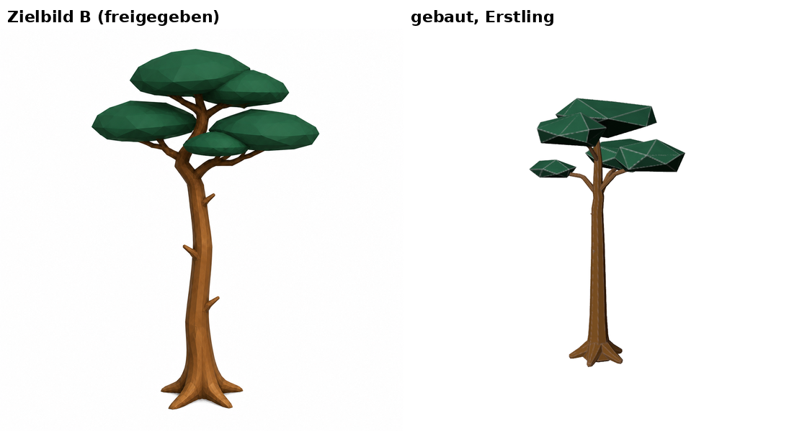

# Kiefer steht im Spiel — acht Varianten, Nadelbaeume damit komplett

Studio#407. Zielbild **B** hattest du in cnc#89 freigegeben („A geht jetzt in
den Bau, B folgt"). Das hier ist das Ergebnis, kein neuer Vorschlag.

## Die acht Varianten

Zeilen: Front · RTS 55° · Aufsicht. Alle acht dicht (0 offene Raender, 0
nicht-mannigfaltige Kanten) beim ersten Wurf, alle exakt 800 Dreiecke, acht
verschiedene Modell-Pruefsummen — kein Zwilling im Bogen. Gebaute Hoehe
36,2 .. 44,2 Elmo.

## Massstab: Kiefer neben Fichte

Windows-Engine (`tools/terrain_sichttest.ps1`), Wegwerf-Karte *Kiefernprobe
0.1*. `armpw`-Grunts (32 Elmo) als Massstab dazwischen.

| | gebaute Hoehe | Fussabdruck `armpw` = 32 Elmo |
|---|---|---|
| **Kiefer** (neu) | 36,2 .. 44,2 Elmo | 1,13 .. 1,38 × |
| Fichte (#397) | 38,3 .. 41,9 Elmo | 1,20 .. 1,31 × |
| Leitbaum (#362) | 32 .. 42 Elmo | 1,00 .. 1,31 × |

Gleiche Groessenklasse, dritter Umriss — Schirm auf Stiel gegen schmalen
Zackenkegel gegen breite gelbgruene Wolke.

## Render gegen dein Zielbild

Unterste Nadelkante +0,5 %, Nadelmasse −0,9 %, oberstes Holz −3,3 %. Die
Silhouette misst in der Frontansicht −8,5 %, in der Seitenansicht +1,1 % — der
Schirm steht rundum, das Zielbild zeigt die breite Seite. Nicht nachgezogen,
sondern gemessen und vermerkt.

## Was maschinell schon steht

16 FeatureDefs (8 Kiefern + 8 Stuempfe), laengster Name 24 von 30 Byte, alle
`conatus_resource = "wood"`, jede Zerfallskette aufloesbar; Holzernte-Waechter
PASS (133 statt 117 Ressourcen-Features, Bilanz 98300/98300). Alles aus
eigener Fabrik, je Datei ein Herkunftsnachweis.

## Offen — nur wenn du willst

Der Kiefernschirm beginnt bei 28,1 Elmo; ein Grunt (26 Elmo hoch) passt
darunter durch. Bei Leitbaum und Fichte war das ausdruecklich nicht so. Hier
ist es der Typ — unter der Kiefer sieht man Boden. Keine Rueckmeldung = bleibt
so.
