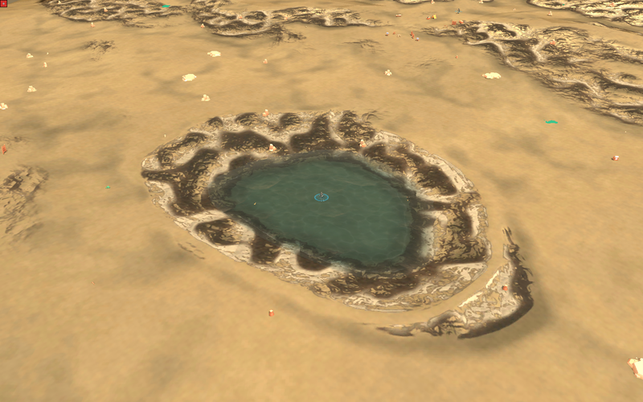
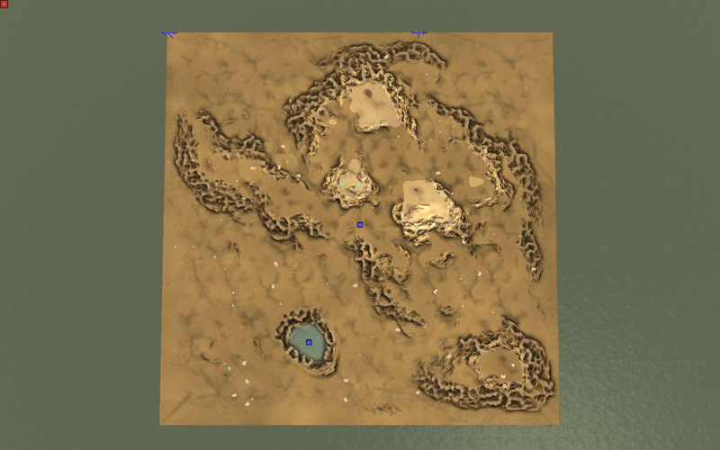
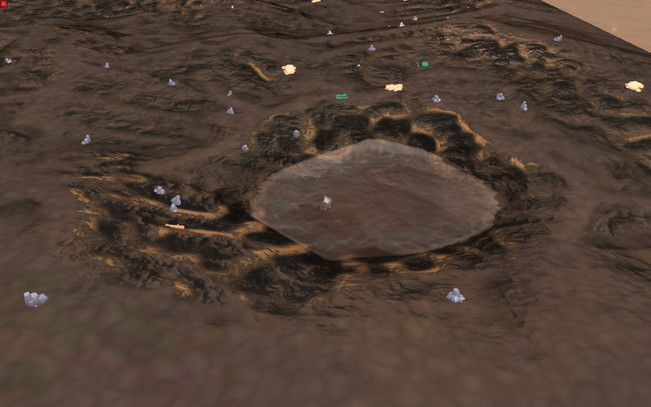
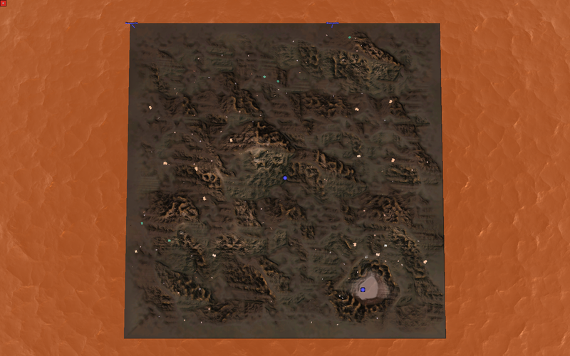
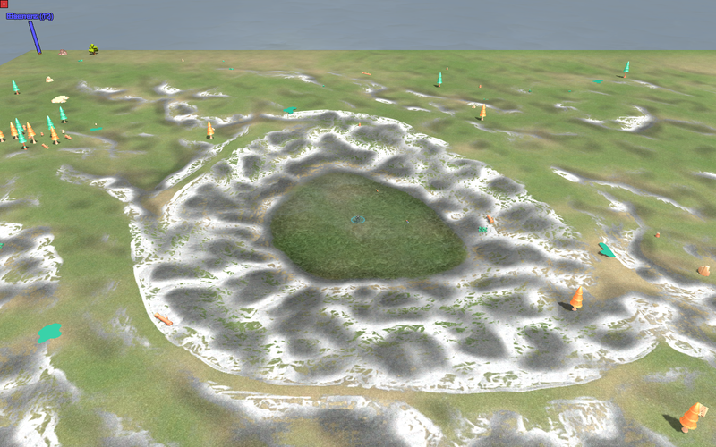
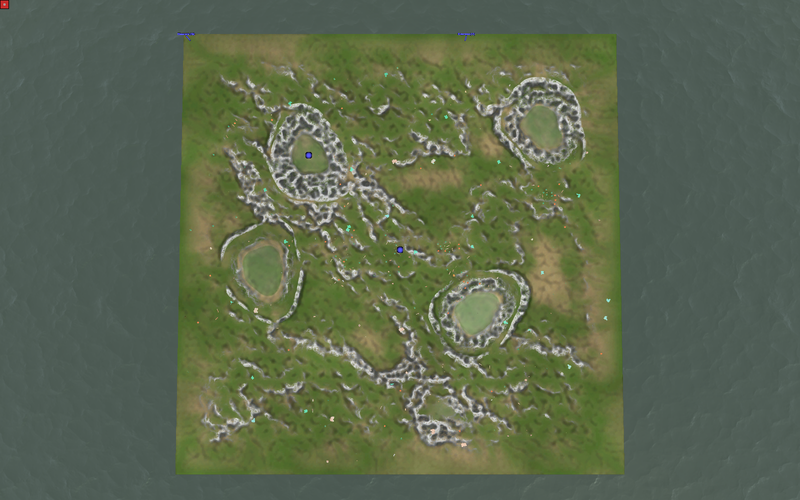

# Wasserarten je Biom — Fluss, Oase, Sumpfwasser, Lava, Eisflaeche

Studio#387, Ansage des Menschen cnc#75 (2026-08-16). Stand 2026-08-18.

Alle Bilder sind **Datenbilder**: Hillshade aus der 16-Bit-Hoehenkarte des
gebauten Kartenpakets (SMF), Wasser eingefaerbt mit `surfaceColor`/`minColor`
der jeweiligen Wasserart. **Kein GL, kein Screenshot.** Wie das Wasser in der
Engine wirklich aussieht, sagt nur die Sichtpruefung unter Windows — die Engine
mischt Absorption, Fresnel und Spiegelung dazu, die hier nicht nachgestellt
sind.

## Was die Engine kann (nachgelesen, nicht geraten)

| Frage | Antwort | Beleg |
|---|---|---|
| Eigene Hoehe je Wasserart? | **Nein.** Ein Spiegel, bei 0 Elmo, `constexpr` | `RecoilEngine/rts/Map/Ground.h:35-38` |
| Wann wird Wasser gezeichnet? | Nur wenn ein Punkt der Karte unter 0 liegt | `ReadMap.cpp:919`, `ReadMap.h:215` |
| Farbe des Grundes | `baseColor − absorb · Tiefe`, geklemmt auf `minColor`; bis 10 Elmo mischt der Boden mit | `SMFFragProg.glsl:23,236-238` |
| Schaden | `water.damage` = **Trefferpunkte je Sekunde** | `MapInfo.cpp:236`, `Unit.cpp:983,1211-1226` |
| Schwimmverbot | Nur mittelbar: Schaden bremst (`1/(1+d·0,1)`), ab 1e3/1e4 unpassierbar — **fuer die ganze Karte** | `MoveDefHandler.cpp:157-160` |

**Vorbild BAR:** Lava laeuft dort **nicht** ueber `mapinfo.water`, sondern ueber
ein Spielseiten-Gadget (`luarules/gadgets/map_lava.lua`, `modules/lava.lua`,
Konfiguration je Karte in `common/configs/LavaMaps/`). Wichtig fuer uns ist der
Rueckfallzweig `modules/lava.lua:240`: eine Karte mit `water.damage > 0` gilt
BAR automatisch als Lavakarte. Genau diesen Weg gehen wir — ConatusV0 hat kein
Lava-Gadget. Uebernommen wurde **nichts**, nur der Aufbau nachgelesen.

## Die fuenf Arten, gemessen an der gebauten Karte (512×512 Squares)

| Art | Biom | technisch Wasser | nasse Punkte von 263 169 | tiefster Punkt | Schaden |
|---|---|---|---|---|---|
| `fluss` | temperate | ja | 32 470 (12,3 %) | −20,0 Elmo | 0 |
| `oase` | desert | ja | **1 993 (0,76 %)** | −9,0 Elmo | 0 |
| `sumpfwasser` | temperate | ja | 7 687 (2,9 %) | −2,5 Elmo | 0 |
| `lava` | volcanic | ja (die Engine kennt nur Wasser) | 2 443 (0,93 %) | −24,0 Elmo | **120 HP/s** |
| `eisflaeche` | ice | **nein (aufgemalt)** | **0** | +1,5 Elmo | 0 |

Vollstaendig samt Muldenbericht: `messwerte.json` neben den Bildern.

## Die Bilder

- `oase-uebersicht.png` / `oase-ausschnitt-3x.png` — **das Kernbild**: eine
  trockene Wueste mit genau **einer** Wasserstelle. Vorher war dieselbe Karte
  zu **15,0 %** nass (39 503 Punkte), bevor ueberhaupt eine Oase gegraben war —
  der Generator streckt sein Rauschen immer auf das ganze Hoehenband, der
  tiefste Punkt liegt also immer auf `hoehe_min`. Der **Landsockel** hebt das
  Land ueber den Spiegel; erst dadurch ist die Mulde die Wasserstelle der Karte
  und nicht eine unter vielen.
- `lava-uebersicht.png` / `lava-ausschnitt-3x.png` — ein Kessel, 24 Elmo tief,
  0,93 % der Karte. Ohne Landsockel waeren 2,4 % der Karte Lava gewesen: es
  gibt genau **einen** Wasserwert je Karte, also waere jede Rauschsenke
  ebenfalls toedlich.
- `sumpfwasser-uebersicht.png` / `-ausschnitt-3x.png` — vier breite, flache
  Tuempel (2,5 Elmo tief). Die Umrisse sind **gewellt, nicht kreisrund**: das
  Sichturteil zu #386 lautete „die Ecken wirken wie ein unnatuerlicher,
  gleichfoermiger Schnitt", und vier exakte Kreise lesen genauso.
- `eisflaeche-uebersicht.png` / `-ausschnitt-3x.png` — eine ebene Platte auf
  +1,5 Elmo, und **kein einziger nasser Punkt** auf der ganzen Karte. Genau das
  ist „nicht technisch Wasser": liegt nichts unter 0 Elmo, zeichnet kein
  Renderer Wasser.
- `fluss-uebersicht.png` — die Wasserwerte der Art auf natuerlichen Senken.
  ★ **Kein Lauf**: ein Fluss braucht ein Zellrezept (Studio#396), und dieser
  Kartensatz wird ohne gebaut. Das echte Flussbild steht in
  [`2026-08-18-kontinentfeld-gewaesser`](../2026-08-18-kontinentfeld-gewaesser).

## Was hier offen bleibt

- ★ **Die Eisflaeche ist halb fertig.** Form ja, **Bemalung nein** — Eis
  aufmalen heisst die SSMF-Diffuse einfaerben (`bake.py`/`ssmf.py`/`tiles.py`)
  und gehoert zu #16 (`area:terrain`, Mensch).
- **Die Wasserart erreicht die Zellkarten noch nicht** — dort gilt weiter die
  Biom-Vorgabe. Sie im Zellrezept zu verankern zieht `CELL_MAPSET_VERSION` und
  den Lua-Zwilling nach; eigener Vorgang.
- **Lava ohne Gadget**: kein Pegel ungleich 0, keine Gezeiten, keine echte
  Emission. Schwimmfaehige Einheiten treiben weiter auf der Flaeche — sie
  verbrennen dabei.
- **Kein Sichtbeweis.** Siehe oben: Datenbilder.

---

## ★ NACHTRAG 2026-08-18 (Erst-Abnahme): die Beispielkarten in der Engine, unter WINDOWS

Alles oben sind Datenbilder aus der Hoehenkarte. Hier stehen die **gebauten
Kartenpakete** zum ersten Mal in der **Spiel-Engine unter Windows**
(Renderer Intel(R) Arc(TM) Graphics, `tools/terrain_sichttest.ps1`,
Wasser-Renderer `Water = 4` aus `config/conatus_springsettings.cfg`).

Gebaut mit `build-water-mapset --arten oase lava sumpfwasser eisflaeche` aus
Studio-`main` 61fa57f. Die Messwerte stimmen **auf den Punkt** mit dem
Builder-Bericht: Oase 1 993 nasse Punkte (0,76 %), Sumpf 7 687 (2,92 %),
Lava 2 443 (0,93 %), Eisflaeche **0**.

### Oase — funktioniert

Eine tuerkise Wasserstelle in einer trockenen Wueste, gewellter Umriss, Ufer
begehbar. Genau die Ansage aus cnc#75.

### Lava — die Form stimmt, die Farbe nicht

Der Kessel ist da (−24 Elmo, `damage = 120` HP/s steht in der `mapinfo.lua`),
**aber die Oberflaeche steht stumpf graubraun statt gluehend.** `baseColor
{1.0, 0.78, 0.22}` und `ambientFactor 1.5` reichen unter BumpWater nicht, um
Emission vorzutaeuschen — BumpWater beleuchtet, es leuchtet nicht. Wer
gluehende Lava will, braucht den Weg, den der Builder-Bericht schon benennt:
ein Spielseiten-Gadget mit eigener Ebene (BAR macht es so). **Das ist ein
neuer Vorgang, kein Fehler dieses Zuges** — der Zug hat geliefert, was
`mapinfo.water` hergibt.

### Sumpfwasser — Tuempel da, aber das Gelaende drumherum ist weiss gescheckt

Der Tuempel liest sich als truebes gruenes Wasser. Auffaellig ist etwas
anderes: **ueber die ganze Karte liegt ein weiss-graues Splat-Muster auf jeder
Neigung.** Das ist die Gelaendetextur (SSMF/Splat), nicht das Wasser —
Terrain-Look, **Studio#16**. Es faellt hier nur auf, weil Landsockel und Mulde
neue Haenge erzeugen.

### Eisflaeche — bewusst nicht abgezogen

0 nasse Punkte, also zeichnet kein Renderer Wasser. Die **Bemalung** fehlt
(Eis aufmalen = SSMF-Diffuse einfaerben = Terrain-Look, Studio#16). Ein Bild
haette nur eine leere weisse Platte gezeigt.
