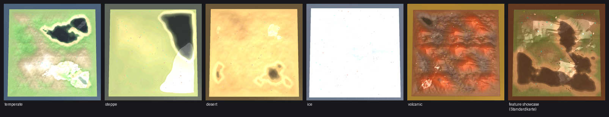
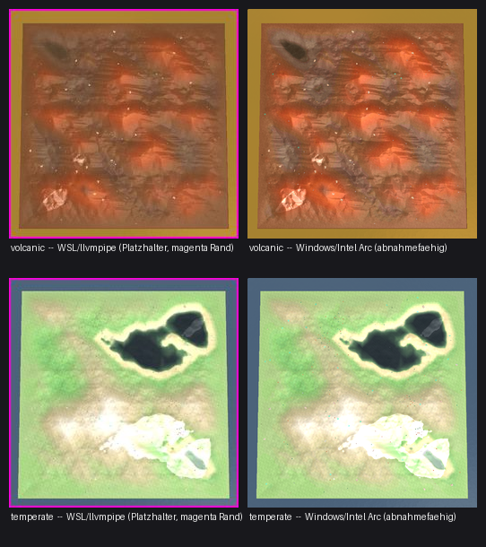

# Weltmenue-Vorschaubild = Engine-Abzug je Karte (Studio#388, cnc#75)

Ansage des Menschen (cnc#75, 2026-08-16): *"Karte wird geladen, Screenshot mit
passender Kamera-Einstellung, Bild fuers Weltmenue. Ist simpel, und man
koennte es aktualisieren."*

## ★ NACHTRAG 2026-08-18: die Windows-Bilder sind da

Erst-Abnahme, Lauf auf der Spiel-Engine unter Windows
(`tools\\conatus_zellbild.ps1`, Renderer **Intel(R) Arc(TM) Graphics**).
**Alle sechs** Beipackzettel stehen jetzt auf `"platzhalter": false` /
`"abnahmefaehig": true`, kein magenta Rand mehr. Kamera-Hashes **6 von 6**
gegen die Referenzliste PASS -- Windows und WSL rechnen dieselbe Kamera.

Die Rohdateien liegen unter `windows/` (`-abzug.png` = voller Engine-Abzug
768x768, `-menue.png` = fertiges Menuebild 256x256).

### Taugt ein WSL-Bild als Menuebild? Jetzt gemessen: kommt aufs Biom an

Mittlere Kanalabweichung ueber die Bildinnenflaeche (254x254), WSL/llvmpipe
gegen Windows/Intel Arc:

| Karte | mittlere Abweichung | Bildpunkte ueber 8 |
|---|---|---|
| volcanic | **11,7** | **76,5 %** |
| temperate | 3,5 | 6,1 % |
| ice | 2,3 | 4,2 % |

**Wasser und Lava trennen die beiden Renderketten, Gras und Eis kaum.** Der
Lavakessel ist unter Windows glutorange, unter WSL grau -- ein WSL-Bild haette
auf der Vulkankarte das Falsche gezeigt.

### Was beim ersten Lauf schieflief (behoben)

`tools/conatus_zellbild.ps1` war nie gelaufen. Eine lokale Variable `$roh`
(Pfad der Roh-PNG) hat den gleichnamigen Parameter `-Roh` ueberschrieben --
PowerShell unterscheidet keine Gross-/Kleinschreibung. Folge: das Werkzeug
meldete FAIL, obwohl das Bild schon geschrieben war. Behoben durch Umbenennen
der lokalen Variable (Branch `agent/issue-388-windows`, nicht gemergt).

### Was daran auffaellt und NICHT von #388 kommt

Auf `temperate` und `steppe` steht das Wasser auch unter Windows **schwarz**,
nicht blau. Diese Kartenarchive sind der veroeffentlichte Satz 0.1 und tragen
den Wasserblock von vor Studio#387. Kein Befund gegen das Zellbild-Werkzeug.

---

## ★ Alles UNTERHALB dieser Zeile ist PLATZHALTER (Stand vor dem Nachtrag)

Die Bilder sind unter WSL entstanden. Dort rendert die Engine ueber **llvmpipe**
(Software-GL, gemessen: `GL renderer : llvmpipe (LLVM 21.1.8, 256 bits)`), nicht
ueber die Grafikkarte der Spiel-PCs. Wasser steht schwarz/weiss statt blau, das
Gelaende ist ausgewaschen, Schatten und Nebel fehlen. Laut `CLAUDE.md` zaehlt
ein Sichturteil **nur unter Windows**.

Erkennbar am **grell magentafarbenen Rand** um jedes Bild und an
`"platzhalter": true` im Beipackzettel.

Was die Bilder trotzdem belegen: **Kamera, Ausschnitt, Aufbau, Dateigroesse,
Menue-Einbau.** Die ganze Karte steht mittig im Bild, mit 4-6 % Luft an jeder
Kante -- das ist die Zusage, die hier geprueft werden kann.

Abnahmefaehige Bilder entstehen mit `tools/conatus_zellbild.ps1` unter Windows
(gleiche Kamera, gleiche Namen, gleiche Rechnung -- beide Wege rufen
`tools/conatus_zellbild.py`).

## Was man sieht

| Datei | Was |
|---|---|
| `weltmenue-mit-zellbild.png` | Weltuebersicht MIT Bild je Kachel; rechts die Detailkarte, ebenfalls mit Bild. Der magentafarbene Rand ist die Platzhaltermarke. |
| `weltmenue-ohne-zellbild-rueckfall.png` | **Rot-Probe**: Bildordner entfernt. Die Kacheln fallen auf die Darstellung von vor #388 zurueck (Rahmen, Text, Biomfleck) -- nicht weiss, nicht leer, kein Absturz. |
| `hauptmenue-logo-unveraendert.png` | Gegenprobe: das Logo im Hauptmenue steht noch. Es ist der einzige andere Aufrufer der geaenderten Zeichenfunktion. |
| `<karte>-abzug.png` | der volle Engine-Abzug 768x768, aus dem das Menuebild wird |
| `<karte>-menue.png` | das fertige Menuebild 256x256 (im Spiel als JPEG, 4-13 KB) |

## Warum der Rueckfall nicht selbstverstaendlich ist

`gl.Texture("gibtsnicht.jpg")` gibt in Recoil **true** zurueck und bindet
Textur 0 = **weiss**. Beim ersten Rot-Probe-Lauf standen darum alle 25 Kacheln
weiss da, statt zurueckzufallen. Der Rueckfall haengt jetzt an einer Pruefung
mit `VFS.FileExists` **vor** dem Zeichnen, nicht am Rueckgabewert.
Belegkette an der Engine-Quelle: `LuaMenu/conatus/ui_draw.lua`, Kopf von
`D.image`.
