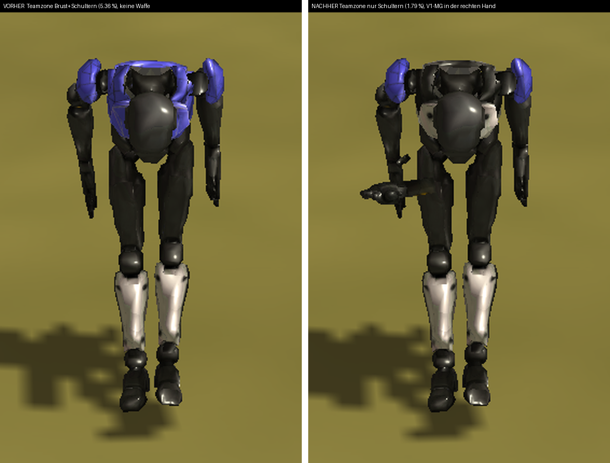
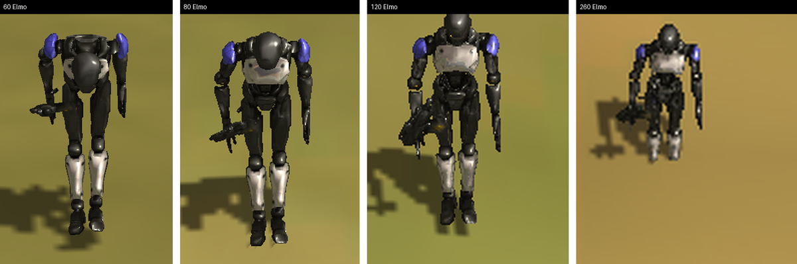
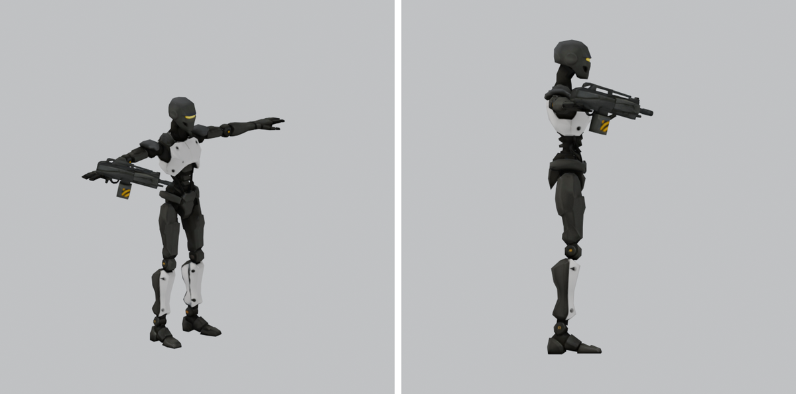

# LeichterAndroidV2 — Waffe von V1, Teamfarbe nur an den Schultern

Studio#447, zwei Ansagen des Menschen aus
[cnc#114](https://github.com/DipsitterUG/dipsitter-cnc/issues/114)
(2026-08-20, 05:28):

1. *„koenntest du ihm die Waffe von V1 geben und einbauen? Probiers mal aus"*
2. *„Teamfarbe: ja zuviel, bitte nur Schultern"*

Alle Bilder mit **Windows**-Abzuegen sind echte Engine-Bilder
(`tools/terrain_sichttest.ps1`, Karte „Conatus Feature Showcase 0.1",
1600 × 1000, Fenster ausserhalb des Schirms). WSL-Renderbilder zaehlen fuer
das Sichturteil nicht; die Bauvorschau unten ist Dokumentation, kein Urteil.

## 1. Teamfarbe: vorher / nachher

Beide Haelften: **derselbe Kamerastand** (250/520, Hoehe 60, Neigung 62),
dieselbe Karte, dieselbe Engine, derselbe Frame — links der Stand vor #447,
rechts danach. Links liegt die Spielerfarbe ueber Brust und Kragen, rechts
nur noch auf den beiden Schulterkappen. Gemessen im Koerperatlas:
**5.356 % → 1.790 %** der Flaeche.

Rechts ausserdem zu sehen: das **`Machine_Gun`-Piece von V1** in der rechten
Hand. Links ist die Hand leer — die Waffe war dort nur eine Zahl in der
UnitDef.

## 2. Abstandsreihe 60 / 80 / 120 / 260 Elmo

Was traegt: die Waffensilhouette bleibt bis 260 Elmo als eigener Umriss
erkennbar, und die beiden blauen Schulterflecken halten ueber die ganze
Reihe — sie sind klein, aber sie sind das Einzige, was auf Spielentfernung
noch Farbe traegt. Die Haltung (gebeugt) ist der **Verbeugen-Clip** aus der
Leerlaufschleife, kein Modellfehler.

## 3. Bauvorschau — Dreiviertel und Seite (Blender, kein Sichturteil)

Die S3O-Ruhelage ist die **T-Pose** (so verlangt es die Clip-Bibliothek,
Studio#428/#433). Die Waffe wird nur **verschoben**, nicht gedreht: der Lauf
zeigt nach vorn, weil das Zielen ueber den Torso giert und die Clips den Arm
im Kern um die Vorne-Achse an den Koerper holen.

**Ehrliche Grenze:** V1 haelt die Waffe mit **beiden** Haenden, V2 nicht —
die linke Hand bleibt, wo der Clip sie hinstellt. Das braucht eine Aim-Pose,
kein Modellteil.

## Herkunft

Geometrie, Basecolor und Animation aus **Tripo AI**, erzeugt auf dem
**bezahlten Konto des Menschen**, geliefert ueber cnc#113 — **Eigentum
Dipsitter**. Das `Machine_Gun`-Piece stammt aus dem V1-GLB
(`robot_figure.glb`), derselbe Tripo-Zugang. Kein Byte aus BAR, Recoil oder
einem Sample-Projekt; deshalb kein `BAR-`-Praefix.
