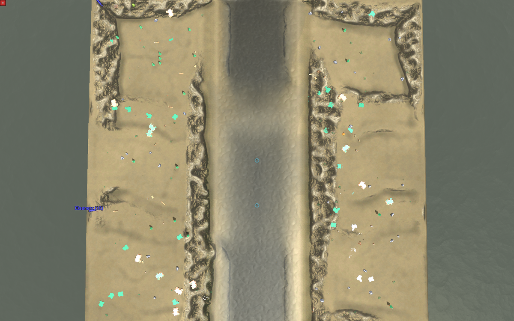
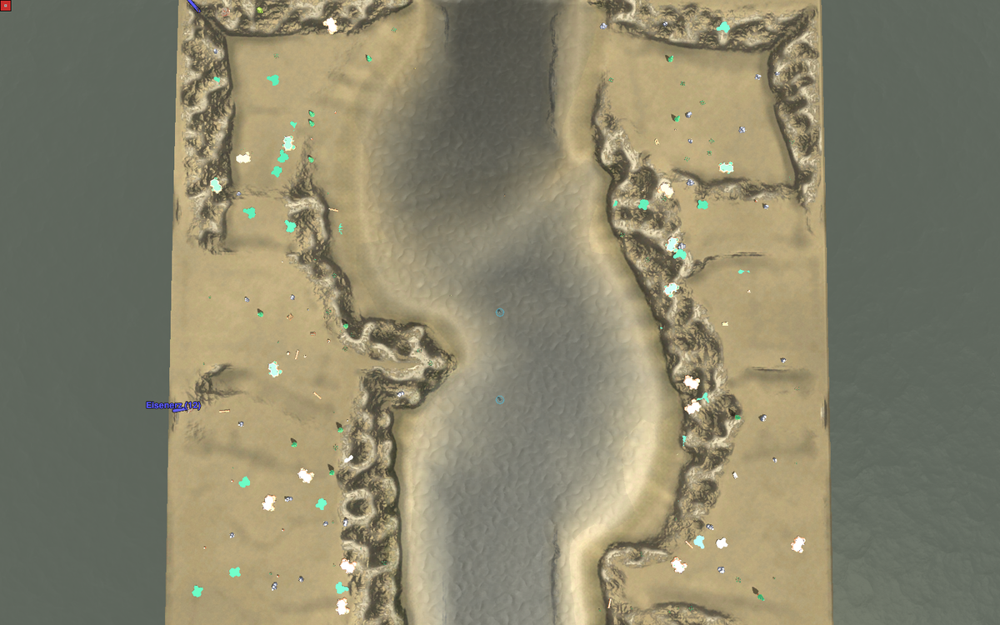
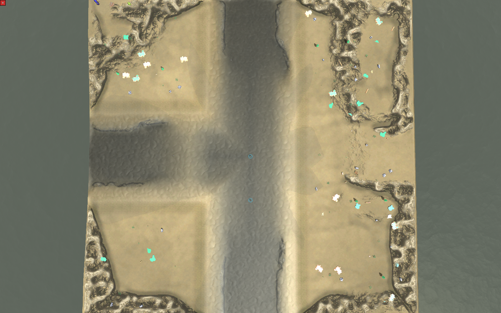
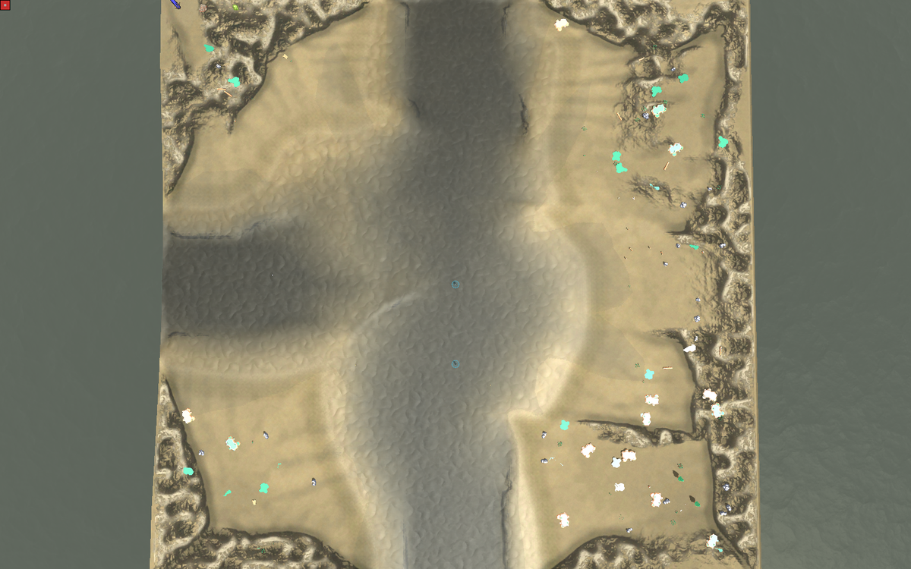

# Fluesse maeandern statt Kanal (Studio#426, Antwort auf cnc#102)

**2026-08-20.** Alle acht Bilder sind **Windows**-Abzuege der Spiel-Engine
(`tools/terrain_sichttest.ps1`, Renderer der Windows-Installation, `Water = 4`),
gleiche Kamera, gleiche Zelle, gleicher Codestand — der einzige Unterschied ist,
ob die Maeander eingeschaltet sind.

## Was der Mensch gesagt hat

Zu den Bildern aus [#408](https://github.com/DipsitterUG/Conatus-Studio/issues/408)
(dipsitter-cnc#102, 2026-08-18):

> Ja behoben, aber die Flussverlaeufe sehen nicht mehr natuerlich aus. Die sehen
> aus wie Kanaele. Leicht geschlaengelt ohne unnatuerliche Verengungen muss doch
> moeglich sein?

## Zelle 2-7 — ein Lauf von Nord nach Sued, der saubere Fall

**vorher**: schnurgerade, ueberall gleich breit. Genau der Kanal.

**nachher**: geschlaengelt, mit atmender Breite.

RTS-Winkel dazu: [vorher](windows/zelle-2-7-rts-vorher.png) ·
[nachher](windows/zelle-2-7-rts-nachher.png)

## Zelle 2-6 — die Nachbarzelle, zwei Laeufe kreuzen sich

**vorher**: ein rechtwinkliges Rohrkreuz.

**nachher**: beide Laeufe bogig, die Kreuzung wird zu einer breiten Flaeche.

RTS-Winkel dazu: [vorher](windows/zelle-2-6-rts-vorher.png) ·
[nachher](windows/zelle-2-6-rts-nachher.png)

## Gemessen am gebauten Hoehenfeld, nicht geschaetzt

Nasse Breite je Kartenzeile (Wasserspiegel = 0 Elmo), Zelle 2-7 ist der saubere
Fall, weil dort genau **ein** Lauf durchgeht:

| Zelle 2-7 | vorher | nachher |
|---|---|---|
| Breite Median | 65 px | **82 px** (+26 %) |
| Breite min / max | 63 / 67 | 63 / 96 |
| min / Median (Engstelle) | 0,97 | **0,77** (Zusage: ≥ 0,70) |
| Std / Median (Atmung) | 0,008 | **0,134** (Zielband 0,10–0,25) |
| Spanne der Mittellinie | 1,0 px | **37,0 px** |
| Richtungswechsel des Laufs | (gerade) | **5** |
| nasse Flaeche der Karte | 25,2 % | **31,5 %** |

Zelle 2-6 (Kreuzung zweier Laeufe, zeilenweise Messung deshalb unscharf):
nasse Flaeche **36,9 % → 44,1 %**.

**Der Fluss ist im Mittel rund ein Viertel breiter geworden.** Das ist kein
Nebeneffekt, sondern Absicht: die Breitenwelle laeuft von 1,00 bis 1,50 und
**verbreitert nur, verengt nie** — eine Welle, die auch nach unten ginge, haette
genau die Engstellen zurueckgebracht, die cnc#90 abgestellt hat.

## Wie die Bilder entstanden sind

1. `build-cell-mapset --zellen "2,6;2,7" --map-units 4` aus Studio-`main`
   (99670a8) in ein **Wegwerf-Verzeichnis** — zweimal: einmal wie ausgeliefert
   (**nachher**), einmal mit `MAEANDER_ANTEIL = 0` und `BREITE_ANTEIL = 0`
   (**vorher**). Beide Staende unterscheiden sich in nichts anderem.
2. `.sdd` → `.sd7` (7z).
3. `powershell -File tools\terrain_sichttest.ps1 -MapFile <sd7> -Map "<Springname>"
   -Kameras "1024,1024,2400,3|1024,1300,700,60"` — Aufsicht und RTS-Winkel.

## Was diese Bilder NICHT zeigen

- **Keine Partie.** Ob sich der Bogen als Hindernis richtig *anfuehlt*, sagt nur
  ein Spiel.
- **Nur zwei von hundert Zellen**, und beide als **4x4-Map-Units-Wegwerfkarte**
  (die ausgelieferte Zelle ist 8x8). Die Anteile stimmen, die absolute Groesse
  ist die halbe.
- **Der Terrain-Look ist nicht Gegenstand** dieses Vorgangs (Studio#16).

## Verweise

- Vorgang: <https://github.com/DipsitterUG/Conatus-Studio/issues/426>
- Vorlaeufer: [#408](https://github.com/DipsitterUG/Conatus-Studio/issues/408)
  (Fluesse ohne Verengung), Bilder dort:
  [2026-08-18-fluesse-ohne-verengung](../2026-08-18-fluesse-ohne-verengung/)
- Doku: `docs/worldgen/geerbte-geografie.md`, Abschnitt „Maeander"

Herkunft: Eigenarbeit. Kein fremdes Bildmaterial, keine fremden Daten.
